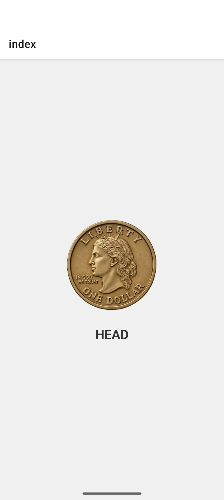

# Flip a coin

## Installation

0. Install Visual Studio Code.

1. Install node.js. 
https://nodejs.org/en/download
(To check for installment, go to terminal and enter the command ``` node --version ```)

2. Next, download the code.  
   a. Open the github repository.  

   b. Click the green ``` Code ``` button on the top right of the screen.  

   c. Go into local, then download zip.  

   d. Open the zip file (double-click on it), then move the downloaded folder to a different location on your computer; anywhere other than the downloads folder is preferred.  


3. Open the terminal and ```cd``` to the folder.  
e.g. ```cd apps/```  ```cd flip-coin/```

4. Once you are situated inside the downloaded folder, run the following commands.  
   a. ```npm ci```    

   b. ```npm run start```  

   c. A QR Code should appear after some lines of text.

5. Download Expo Go from the App Store on a mobile device.

6. Scan the QR Code from your terminal using your mobile device. (Logging into Expo Go should not be necessary, but if you have issues, you can try logging in.)


## Editing the Code
Once you have the app running through Expo Go on your phone, you can follow the below steps to make edits. (This will only change the app on your end, and will not alter the actual code.)

1. Open the code on Visual Studio Code.   
(There are many ways to open the file but here is one: Go to Visual Studio Code, look for an ```Open Folder...``` option on the top of the VSCode, select it and open your downloaded file.)

2. If the edits are not automatically mirrored on your application open in Expo Go, go to the terminal (where your QR Code should still be open), type in ```r``` (for refresh), and enter. You should see the changes.


## Home Page

